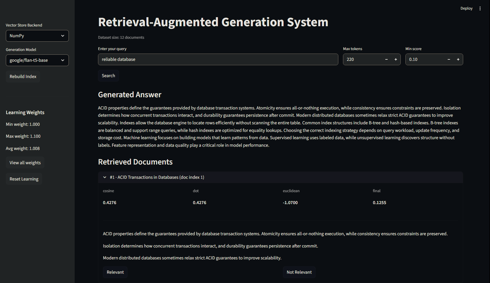

# RAG System — Advanced Database Project

  
  
  
  
  

This project implements a Retrieval-Augmented Generation (RAG) system with a strong focus on **advanced database system concepts**, including:

- Vector storage and indexing
- Similarity search and ranking
- Retrieval evaluation and visualization
- Lightweight, instruction-tuned generation
- Feedback-driven self-learning

The system is designed to be **transparent, testable, and suitable for live evaluation**.

---

## Requirements

- Python 3.11+
- CPU-only execution (no GPU required)

---

## Setup

1. Create and activate a virtual environment

   python -m venv .venv  
   .\.venv\Scripts\activate

2. Install dependencies

   pip install -r requirements.txt

3. Run unit tests

   pytest

4. Start the UI

   streamlit run src/ui/app.py

---

## Features

### Retrieval & Vector Storage
- In-memory vector database
- Two interchangeable backends:
  - NumPy-based vector store (transparent, educational)
  - FAISS-based vector store (high-performance)
- Multiple similarity metrics (NumPy backend):
  - Cosine similarity
  - Dot product
  - Euclidean distance
- Explicit score aggregation and ranking
- Retrieval result inspection in the UI

### Generation
- Lightweight, instruction-tuned generation models (FLAN-T5 family)
- Model selector in the UI
- Configurable generation parameters:
  - Maximum tokens
  - Minimum retrieval score threshold
- Deterministic fallback when retrieval confidence is low
- Generation strictly grounded in retrieved context

### Learning & Feedback
- Feedback-driven self-learning mechanism
- Positive and negative relevance feedback
- Learning weights applied directly to similarity scoring
- Real-time visualization of learning state
- Summary statistics (min / max / average weights)
- Optional detailed inspection of per-document weights

### Quality & Testing
- Full unit test coverage for:
  - Vector stores
  - Retrieval logic
  - Learning behavior
  - Generation behavior
- PEP8-compliant code
- Google-style docstrings
- Modular, readable architecture

---

## Notes

- Dataset is synthetic, mixed-domain, and intentionally heterogeneous
- System is intentionally simple and transparent
- Designed for demonstration, grading, and discussion
- Not intended as a production-ready RAG system
